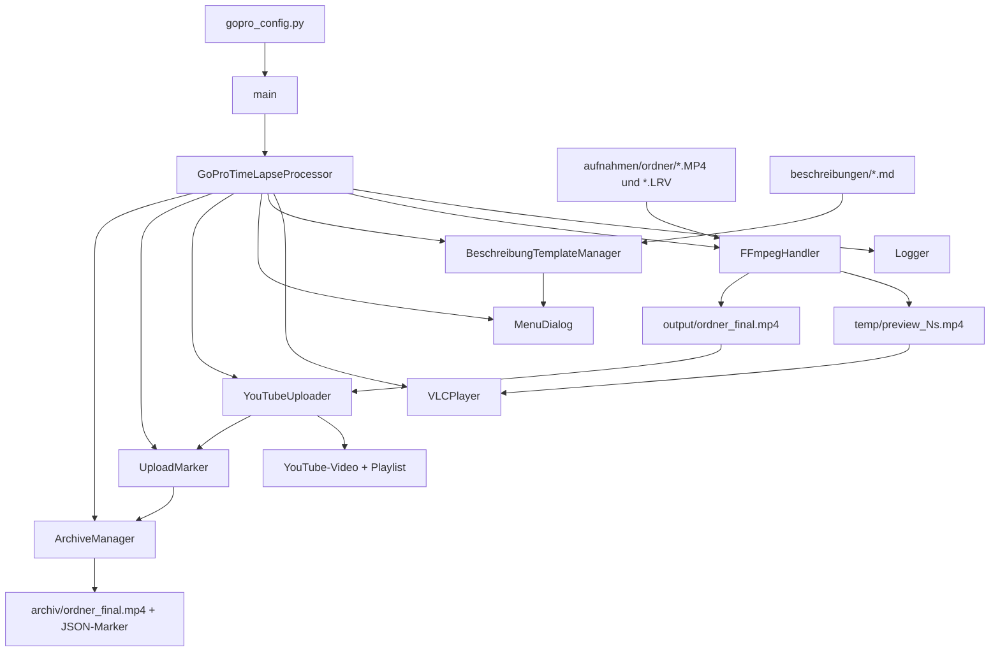

# GoPro Time-Lapse Vibe-Coding Processor – Projektbeschreibung

**Komplexitätsstufe:** Medium (1.340 Non-Blank-LOC, 9 Klassen, 63 Methoden/Funktionen, externe YouTube-API-Integration, externe Binaries FFmpeg/ffprobe/VLC, dateibasierte Konfiguration)

---

## 1. Projektübersicht

- **Projektname:** GoPro Time-Lapse Vibe-Coding Processor
- **Version:** 2.0.23
- **Ziel:** Vollautomatisierte Verarbeitung von GoPro Hero 5 Black 4K-Zeitrafferaufnahmen – von der interaktiven Aufnahmeauswahl über einen schnellen Geschwindigkeits-Testrender, den finalen Zeitraffer-Render, den YouTube-Upload inklusive Playlist-Zuordnung bis zur automatischen Archivierung der Quelldateien.
- **Kernfunktionalität:** Menügeführter Ablauf (`main()`) orchestriert `GoProTimeLapseProcessor`, der Aufnahmeordner listet, per VLC eine Kurzvorschau zeigt, einen Zeitraffer-Testrender mit iterativer Faktor-Anpassung erzeugt, den Finalrender aus allen Quelldateien rendert und via `YouTubeUploader` automatisiert hochlädt.
- **Zielgruppe/Nutzerprofil:** GoPro-Nutzer und Content-Creator, die wiederkehrend Zeitraffer produzieren und einen lokalen, menügesteuerten Workflow ohne manuelles Videoschnittprogramm bevorzugen. Primär Windows-orientiert (VLC-Standardpfade in `VLCPlayer.VLC_PATHS` sind Windows-Pfade), mit PATH-Fallback für andere Betriebssysteme.
- **Einzigartige Verkaufsargumente (USPs):**
  - Automatische Hardware-Encoder-Erkennung (`FFmpegHandler._auto_detect_encoder()`): testet NVENC, Quick Sync, AMF und VideoToolbox per echtem Mini-Testencode (5 Frames auf synthetischer `testsrc`-Quelle) statt sich nur auf `ffmpeg -encoders` zu verlassen.
  - Testrender verwendet ausschließlich die **größte** LRV- bzw. MP4-Datei im Aufnahmeordner (`render_preview()`) – vermeidet unvollständige "Fehlstart"-Clips als Testquelle.
  - Aufnahmedatum wird aus dem `creation_time`-Metadatenfeld der Videodatei gelesen (`FFmpegHandler.get_creation_time()`), nicht aus dem Dateisystem-Zeitstempel, der sich beim Kopieren ändern kann.
  - Wiederverwendbare Beschreibungs-Vorlagen im Markdown-Format (`BeschreibungTemplateManager`) aus einem Zentralordner, inkl. optionalem Override von Aufnahmedatum und Sichtbarkeit.
  - Resume-Upload-Mechanismus (`find_pending_uploads()`, `resume_pending_uploads()`): bereits gerenderte, aber nicht hochgeladene Videos werden beim nächsten Programmstart automatisch erkannt und können ohne erneutes Rendern nachgeholt werden.
- **Aktueller Entwicklungsstand: `Beta`**
  **Begründung:** Der komplette Kern-Workflow (Auswahl → Vorschau → Testrender → Finalrender → Upload → Archivierung) ist vollständig implementiert und wurde iterativ mehrfach gehärtet (u. a. Fix für eingefrorenes Bild via `-fflags +genpts`, Encoder-Fallback-Logik, Datumsermittlung über Metadaten). Es fehlen jedoch automatisierte Tests, eine Retry-/Backoff-Strategie für YouTube-API-Netzwerk- oder Quota-Fehler, und die VLC-Pfaderkennung ist auf Windows fokussiert – in Summe der typische Reifegrad einer funktional vollständigen, aber noch nicht produktionsgehärteten Anwendung.

---

## 2. Funktionale Anforderungen

### Must-Have

| Feature | Priorität | Status | Beschreibung |
|---|---|---|---|
| Konfiguration laden | 🔴 | ✅ | `import gopro_config as cfg` beim Modulstart; fehlende Pflichtwerte lösen `AttributeError` → `sys.exit(1)` aus. |
| Aufnahme-Auswahl | 🔴 | ✅ | `list_recordings()` listet Unterordner mit `*.MP4`, `MenuDialog.show_recording_list()` übernimmt die Auswahl. |
| Erste Clip-Vorschau | 🔴 | ✅ | `preview_first_clip()` spielt den ältesten MP4-Clip 20s über `VLCPlayer.play()` ab. |
| Geschwindigkeits-Testrender | 🔴 | ✅ | `render_preview()` nutzt die größte LRV-Datei (Fallback: größte MP4-Datei), rendert mit `adjust_speed_with_progress()`. |
| Finalrender | 🔴 | ✅ | `render_final()` concateniert **alle** MP4-Dateien (`concat_files()`) und rendert in voller Auflösung. |
| YouTube-Upload | 🔴 | ✅ | `YouTubeUploader.upload_video()` nutzt OAuth 2.0 (`_get_credentials()`) und `MediaFileUpload` (resumable). |
| Playlist-Zuordnung | 🔴 | ✅ | `add_to_playlist()` fügt das Video der global konfigurierten `YOUTUBE_PLAYLIST_ID` hinzu. |
| Uploadmarker + Archivierung | 🔴 | ✅ | `UploadMarker.write_marker()` erzeugt `<video>.uploaded.json`, `ArchiveManager.archive_with_retry()` verschiebt Video + Marker. |
| Resume-Upload | 🔴 | ✅ | `find_pending_uploads()` erkennt Videos in `OUTPUT_DIR` ohne gültigen Marker; `resume_pending_uploads()` lädt sie direkt hoch. |

### Should-Have

| Feature | Priorität | Status | Beschreibung |
|---|---|---|---|
| Beschreibungs-Vorlagen | 🟡 | ✅ | `BeschreibungTemplateManager` durchsucht `BESCHREIBUNG_DIR` rekursiv nach `*-beschreibung.md`/`*_beschreibung.md`. |
| Automatische Hardware-Encoder-Erkennung | 🟡 | ✅ | `_auto_detect_encoder()` testet `h264_nvenc` → `h264_qsv` → `h264_amf` → `h264_videotoolbox`, Fallback `libx264`. |
| Aufnahmedatum aus Metadaten | 🟡 | ✅ | `get_creation_time()` liest `format_tags=creation_time` per `ffprobe`; Fallback auf Dateisystem-Zeitstempel mit Warnung. |
| Konfigurierbare Testrender-Dauer | 🟡 | ✅ | `MenuDialog.get_test_preview_duration()`, Standardwert `DEFAULT_TEST_PREVIEW_DURATION = 20`. |
| Thread-sichere Konsolenausgabe | 🟡 | ✅ | `print_lock = threading.Lock()` in `adjust_speed_with_progress()` schützt gegen verschachtelte Ausgabe von Fortschrittsbalken und stderr-Thread. |

### Could-Have

| Feature | Priorität | Status | Beschreibung |
|---|---|---|---|
| Batch-Verarbeitung mehrerer Aufnahmen | 🟢 | ❌ | Nicht implementiert; `main()` verarbeitet pro Lauf genau eine Aufnahme. |
| Thumbnail-Generierung | 🟢 | ❌ | Nicht vorgesehen. |
| YouTube-Retry mit Exponential Backoff | 🟢 | ❌ | Netzwerk-/Quota-Fehler beim Upload werden nur als Exception gefangen und geloggt, kein automatischer Wiederholungsversuch. |

### Use Cases

**Als GoPro-Nutzer möchte ich meine Aufnahme mit einem Testrender aus der größten verfügbaren Datei prüfen, um die passende Zeitraffer-Geschwindigkeit zu finden, bevor das komplette Material gerendert wird.**
Erfolg: `render_preview()` wählt die größte LRV- (bzw. MP4-)Datei per `max(candidate_files, key=lambda f: f.stat().st_size)`, rendert einen Testclip mit `adjust_speed_with_progress()` und spielt ihn über VLC ab.
Fehler: Liefert `get_duration()` für die größte Datei `<= 0` (z. B. beschädigte Datei), bricht `error_and_exit()` mit klarer Fehlermeldung ab.

**Als Content-Creator möchte ich Titel, Beschreibung und Tags aus einer vorbereiteten Markdown-Vorlage übernehmen, um sie nicht bei jedem Video neu eintippen zu müssen.**
Erfolg: `get_job_details()` findet Vorlagen über `BeschreibungTemplateManager.find_templates()`, zeigt ein Auswahlmenü (inkl. Option "0 = manuell") und übernimmt vorhandene Felder aus `parse()`.
Fehler: Werden keine Vorlagen gefunden, loggt `find_templates()` eine Warnung und der Ablauf fährt direkt mit manueller Eingabe fort.

**Als Nutzer möchte ich einen fehlgeschlagenen YouTube-Upload beim nächsten Programmstart automatisch erkannt bekommen, um das Video nicht erneut rendern zu müssen.**
Erfolg: `find_pending_uploads()` durchsucht `OUTPUT_DIR` nach `*.mp4`-Dateien ohne gültigen Uploadmarker (`UploadMarker.read_marker()` liefert `None`); `resume_pending_uploads()` fragt Job-Details erneut ab und lädt direkt hoch.
Fehler: Existiert die Videodatei zwischenzeitlich nicht mehr, wird sie mit einer Warnung übersprungen, ohne das Programm abzubrechen.

---

## 3. Nicht-funktionale Anforderungen

- **Leistungsziele:** `-threads 0` nutzt alle verfügbaren CPU-Kerne beim Software-Encoding; die tatsächliche Renderzeit hängt stark vom gewählten Encoder ab (Hardware-Encoder wie `h264_nvenc` sind gegenüber `libx264` erheblich schneller). Keine explizite Ober­grenze für Dateigröße oder Speicherverbrauch im Code definiert.
- **Sicherheit:** OAuth-Client-Geheimnis und Token liegen lokal in den konfigurierten Pfaden (`YOUTUBE_CLIENT_SECRETS_FILE`, `YOUTUBE_TOKEN_FILE`) und werden nicht verschlüsselt. Eingaben für FPS (`get_target_fps()`, Bereich 1–240) und Geschwindigkeitsfaktor (`get_speed_factor()`, muss `> 0` sein) werden validiert; Titel, Beschreibung und Tags werden dagegen nicht gegen YouTube-eigene Zeichenlimits geprüft.
- **Skalierbarkeits-/Erweiterbarkeitskonzept:** Die Klassenarchitektur trennt Verantwortlichkeiten sauber (`FFmpegHandler`, `YouTubeUploader`, `ArchiveManager`, `BeschreibungTemplateManager` etc.), was Erweiterungen erleichtert. Es existiert jedoch keine Batch-Verarbeitung mehrerer Aufnahmeordner in einem Lauf.

### Identifizierte Schwachstellen

| Schweregrad | Befund | Fundstelle |
|---|---|---|
| 🔴 Kritisch | Kein Retry/Backoff für YouTube-API-Fehler (Netzwerk, Quota). Ein Uploadfehler wird als generische `Exception` gefangen; der Nutzer muss den Upload manuell über den Resume-Mechanismus neu anstoßen. | `main()`, Try-Block um `processor.upload_video()` |
| 🟡 Mittel | `VLCPlayer.VLC_PATHS` enthält ausschließlich Windows-Pfade; auf anderen Betriebssystemen muss VLC im `PATH` liegen. | `VLCPlayer.VLC_PATHS`, `_find_vlc()` |
| 🟡 Mittel | Keine automatisierten Tests (kein `pytest`/`unittest`-Paket im Projekt vorhanden). | Projektweit |
| 🟢 Gering | Fehlt das `creation_time`-Metadatenfeld in einer Videodatei (z. B. bei Bearbeitung durch Drittsoftware), greift der Fallback auf den Dateisystem-Zeitstempel – mit Warnung geloggt, aber potenziell ungenau. | `get_recording_date_from_folder()`, `derive_recording_date_from_folder()` |

---

## 4. Technische Spezifikation

### Systemarchitektur



### Datenfluss

`aufnahmen/<Ordner>/*.MP4` (+ optional `*.LRV`) → `FFmpegHandler` ermittelt größte Datei für den Testrender → `adjust_speed_with_progress()` erzeugt `temp/preview_<N>s.mp4` → `VLCPlayer.play()` zur Kontrolle → nach Bestätigung concateniert `concat_files()` **alle** MP4-Dateien nach `temp/combined.mp4` → Finalrender nach `output/<Ordner>_final.mp4` → `YouTubeUploader.upload_video()` (MP4, resumable Upload) → `UploadMarker` (UTF-8-JSON) → `ArchiveManager` verschiebt Video + Marker nach `archiv/`.

### Datenmodell

| Struktur | Typ | Beschreibung |
|---|---|---|
| `recordings` | `List[Tuple[str, str, str]]` | Ordnername, Startzeit (`%Y-%m-%d %H:%M`), geschätzte Dauer als Text. |
| `mp4_files` / `lrv_files` | `List[Path]` | Nach `st_mtime` sortierte Dateilisten. |
| Uploadmarker | `Dict[str, Any]` (JSON) | `youtube_video_id`, `source`, `video_filename`, `title`, `playlist_id`, `uploaded_at_utc`. |
| `prefill` (Beschreibungs-Vorlage) | `Dict[str, str]` | Schlüssel: `title`, `description`, `tags`, `recording_date`, `privacy_status`. |
| `job_summary` | `Dict[str, Any]` | Anzeige-Dictionary für die Auftragsbestätigung. |
| `_preview_source_cache` | `Dict[Tuple[str, str], Dict[str, Any]]` | Cacht die größte Testrender-Quelldatei pro (Ordner, Dateimuster). |

### Externe Abhängigkeiten

```
google-api-python-client   # YouTube Data API v3 (videos().insert(), playlistItems().insert())
google-auth-oauthlib       # OAuth-2.0-Flow für Desktop-Anwendungen (InstalledAppFlow)
google-auth-httplib2       # Google-Auth-HTTP-Integration
FFmpeg / ffprobe           # externe Binaries, via subprocess: Concatenieren, Encoding, Metadaten-Auslese
VLC Media Player           # externes Binary, via subprocess: Vorschau-Wiedergabe
```
Versionsnummern sind im Code nicht gepinnt; es gilt jeweils die aktuelle stabile Version.

Python-Standardbibliothek: `sys`, `io`, `os`, `subprocess`, `shutil`, `re`, `time`, `json`, `threading`, `datetime`, `pathlib`, `typing`.

### Konfigurationsparameter

| Parameter | Typ | Default | Beschreibung |
|---|---|---|---|
| `YOUTUBE_CLIENT_SECRETS_FILE` | `str` | – (Pflicht) | Pfad zur OAuth-Client-Datei. |
| `YOUTUBE_TOKEN_FILE` | `str` | – (Pflicht) | Pfad zur Token-Datei (wird automatisch erzeugt). |
| `YOUTUBE_PLAYLIST_ID` | `str` | – (Pflicht) | Ziel-Playlist für automatische Zuordnung. |
| `YOUTUBE_PRIVACY_STATUS` | `str` | – (Pflicht) | `"public"` / `"private"` / `"unlisted"`. |
| `YOUTUBE_TAGS` | `list[str]` | – (Pflicht) | Standard-Tags für alle Uploads. |
| `YOUTUBE_CATEGORY_ID` | `str` | – (Pflicht) | YouTube-Kategorie-ID. |
| `YOUTUBE_PUBLIC_STATS_VIEWABLE` | `bool` | – (Pflicht) | Öffentliche Statistikansicht. |
| `YOUTUBE_EMBEDDABLE` | `bool` | – (Pflicht) | Einbetten erlauben. |
| `YOUTUBE_LICENSE` | `str` | – (Pflicht) | `"youtube"` oder `"creativeCommon"`. |
| `YOUTUBE_MADE_FOR_KIDS` | `bool` | – (Pflicht) | COPPA-Kennzeichnung. |
| `YOUTUBE_CONTAINS_SYNTHETIC_MEDIA` | `bool` | – (Pflicht) | KI-generierte Inhalte kennzeichnen. |
| `BASE_DIR` / `OUTPUT_DIR` / `ARCHIVE_DIR` / `LOG_DIR` / `TEMP_DIR` | `str` | leer = relativer Standardpfad | Basisverzeichnisse; leer bedeutet `./output`, `./archiv`, `./logs`, `./temp` relativ zu `BASE_DIR`. |
| `BESCHREIBUNG_DIR` | `str` | leer = `BASE_DIR/beschreibungen` | Zentralordner für Beschreibungs-Vorlagen (via `getattr`, optional). |
| `FFMPEG_ENCODER` | `str` | `"auto"` | `"auto"` (automatische Erkennung), `"libx264"` oder expliziter Hardware-Encoder-Name (via `getattr`, optional). |
| `FFMPEG_PRESET` | `str` | `""` | Encoder-Preset; gültige Werte encoderabhängig (via `getattr`, optional). |
| `DEFAULT_TEST_PREVIEW_DURATION` | `int` | `20` | Modul-Konstante (kein Config-Wert) für die Standard-Testrender-Dauer in Sekunden. |

---

## 5. Qualitätssicherung

### Empfohlene Teststrategie

- **Unit-Tests:** `UploadMarker.write_marker()`/`read_marker()`, `BeschreibungTemplateManager.parse()`, `FFmpegHandler.get_creation_time()` (mit gemocktem `subprocess.run`), `MenuDialog`-Eingabevalidierung mit gemocktem `input()`.
- **Integrationstests:** FFmpeg/ffprobe mit kurzen Test-MP4/LRV-Dateien; Prüfen, dass `concat_files()` korrekte Concat-Listen erzeugt und `adjust_speed_with_progress()` gültige Ausgabedateien liefert.
- **API-Integrationstests:** `YouTubeUploader` mit gemocktem `googleapiclient`-Service; OAuth-Flow, `videos().insert()` und `playlistItems().insert()` ohne echten Netzwerkaufruf.
- **E2E-Test:** Separates Testkonto, `private`-Sichtbarkeit, temporäre Verzeichnisse; nach erfolgreichem Lauf Marker und Archivierung prüfen.

### Konkrete Testfälle

```
Test: render_preview_waehlt_groesste_lrv_datei
Input: Ordner mit drei LRV-Dateien (5 MB, 50 MB, 20 MB)
Erwartetes Ergebnis: adjust_speed_with_progress() wird mit der 50-MB-Datei als input_file aufgerufen
Fehlerfall: get_duration() der gewählten Datei liefert 0.0 -> error_and_exit() mit Meldung "konnte nicht ermittelt werden"

Test: get_creation_time_liest_gueltiges_datum
Input: ffprobe-Ausgabe "2026-06-15T14:23:45.000000Z"
Erwartetes Ergebnis: Rückgabe "2026-06-15"
Fehlerfall: Leere oder nicht zum Muster YYYY-MM-DD passende Ausgabe -> Rückgabe None, Fallback auf Dateisystem-Zeitstempel

Test: uploadmarker_roundtrip
Input: output/demo_final.mp4, youtube_video_id="abc123", title="Demo"
Erwartetes Ergebnis: read_marker() liefert youtube_video_id="abc123" und title="Demo"
Fehlerfall: Beschädigtes/ungültiges JSON -> read_marker() liefert None und loggt eine WARNING-Zeile

Test: beschreibung_template_tags_mehrzeilig
Input: Vorlage mit "# Tags"-Abschnitt über zwei Zeilen ("Berlin, Herbst" / "Zeitraffer")
Erwartetes Ergebnis: parse() liefert result["tags"] == "Berlin, Herbst, Zeitraffer"
Fehlerfall: Leerer Tags-Abschnitt -> Schlüssel "tags" fehlt im Ergebnis-Dict

Test: find_pending_uploads_erkennt_fehlenden_marker
Input: OUTPUT_DIR mit einer .mp4-Datei ohne zugehörige .uploaded.json
Erwartetes Ergebnis: find_pending_uploads() enthält diese Datei in der Rückgabeliste
Fehlerfall: Marker-Datei mit fehlendem youtube_video_id-Feld -> read_marker() liefert None, Datei gilt weiterhin als "pending"
```

### Fehlerbehandlungskonzept

Kritische, nicht behebbare Fehler laufen über `Logger.error_and_exit()` (Log-Eintrag + `sys.exit(1)`), u. a. bei fehlender `gopro_config.py`, fehlendem VLC, fehlgeschlagenem FFmpeg-Concat/-Render oder nicht ermittelbarer Dateidauer im Testrender. Abgefangen werden gezielt `subprocess.CalledProcessError`, `FileNotFoundError`, `OSError`, `ValueError` sowie generische `Exception` beim YouTube-Upload (dort **ohne** erneuten Abbruch des Programms – das Video bleibt in `OUTPUT_DIR` erhalten). **Nicht** gezielt behandelt werden YouTube-Quota-Fehler, Verbindungsabbrüche während des Uploads oder ungültige Metadatenwerte jenseits des Datumsformats.

### Code-Qualität

| Bereich | Bewertung | Begründung |
|---|---|---|
| Wartbarkeit | 8/10 | Klare Trennung in neun fokussierte Klassen mit Einzelverantwortung; Konfigurationswerte konsequent über `getattr()` mit Fallbacks für Abwärtskompatibilität geladen. |
| Lesbarkeit | 7/10 | Durchgehend deutsche Docstrings und sprechende Namen; `main()` und `adjust_speed_with_progress()` sind mit über 60 bzw. 90 Zeilen recht lang und könnten weiter zerlegt werden. |
| PEP 8 / Konventionen | 7/10 | Konsequente Nutzung von `Path`, Type Hints (`List`, `Tuple`, `Optional`, `Dict`, `Any`) und `snake_case`; einige sehr lange Zeilen und tief verschachtelte Bedingungen in `adjust_speed_with_progress()`. |

---

## 6. Deployment & Betrieb

### Systemvoraussetzungen

- Python 3.8 oder neuer
- FFmpeg und ffprobe im `PATH`
- VLC Media Player (Windows-Standardpfade hinterlegt, sonst `PATH` erforderlich)
- Internetverbindung für OAuth-Anmeldung und YouTube-Upload
- Google-Cloud-Projekt mit aktivierter YouTube Data API v3

### Setup

```bash
# Schritt 1: Projektordner anlegen und Hauptskript + gopro_config.py hinein kopieren
mkdir GoProProcessor && cd GoProProcessor

# Schritt 2: Virtuelle Umgebung erstellen und aktivieren (Windows)
py -3 -m venv .venv
.venv\Scripts\activate

# Schritt 3: Python-Abhängigkeiten installieren
python -m pip install --upgrade pip
pip install google-api-python-client google-auth-oauthlib google-auth-httplib2

# Schritt 4: FFmpeg/ffprobe und VLC prüfen
ffmpeg -version
ffprobe -version
vlc --version

# Schritt 5: Ordnerstruktur anlegen
mkdir aufnahmen output archiv logs temp beschreibungen

# Schritt 6: gopro_config.py mit OAuth-Pfaden, Playlist-ID und Sichtbarkeit ausfuellen

# Schritt 7: Anwendung starten
python gopro_timelapse_processor_v2.0.23.py
```

### Monitoring

`Logger.log()` schreibt jede Meldung sofort auf die Konsole **und** in eine Logdatei `logs/<YYYYMMDD_HHMMSS>.log` (eine Datei pro Programmstart). Während des Renderns zeigt die Konsole zusätzlich einen Fortschrittsbalken mit Prozentwert, bisher benötigter Renderzeit und ETA (`adjust_speed_with_progress()`). Nach erfolgreichem Upload dokumentiert `<video>.uploaded.json` die YouTube-Video-ID; nach der Archivierung liegt dieser Marker neben dem archivierten Video.
